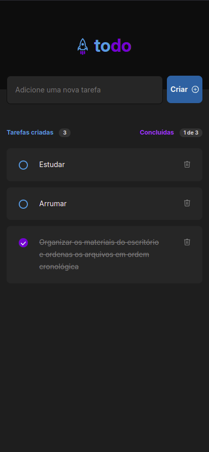
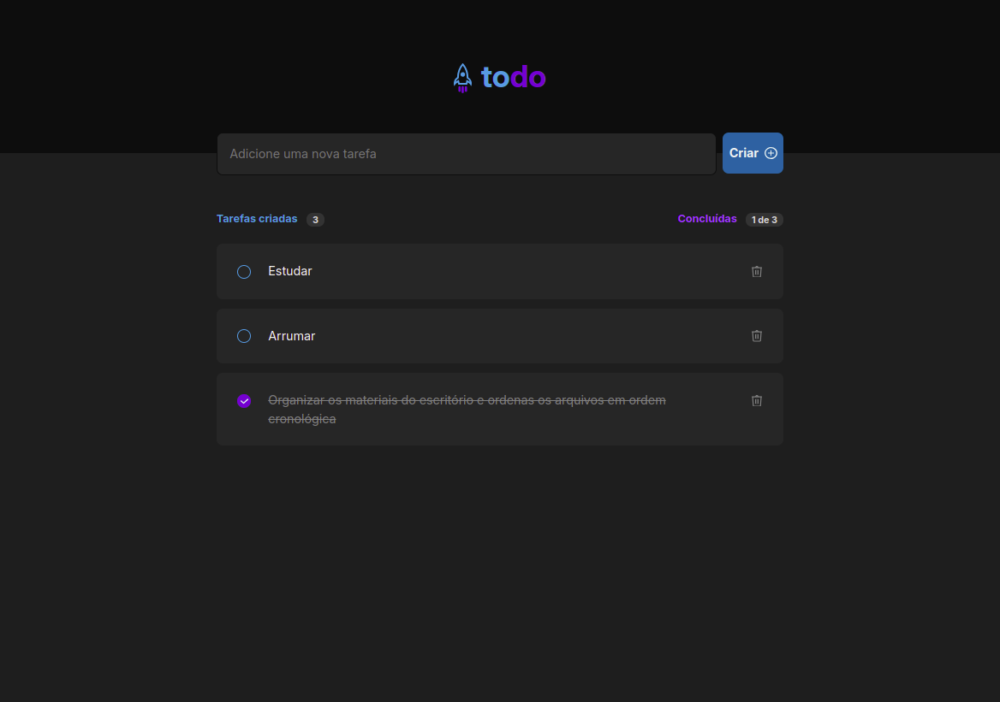

# To Do List

## Funcionalidades

- Adicionar uma nova tarefa
- Marcar e desmarcar uma tarefa como concluída
- Remover uma tarefa da listagem
- Mostrar o progresso de conclusão das tarefas

## Tecnologias utilizadas

- Vite
- React
- Typescript

## Como iniciar

1. Instale as dependências

```bash
npm install
```

2. Compile a aplicação

```bash
npm run build
```

3. Inicie a aplicação (Para acesso local)

```bash
npm run preview
```

## Figma

[To Do List Model](https://www.figma.com/design/dxa3GzzWCZxxq0DnrTvJgH/ToDo-List-%E2%80%A2-Desafio-React?node-id=0-1&node-type=canvas&t=l9N6StR9bK4qb4Tm-0)

## Demo


## Visualização

### Versão Mobile



### Versão Desktop


